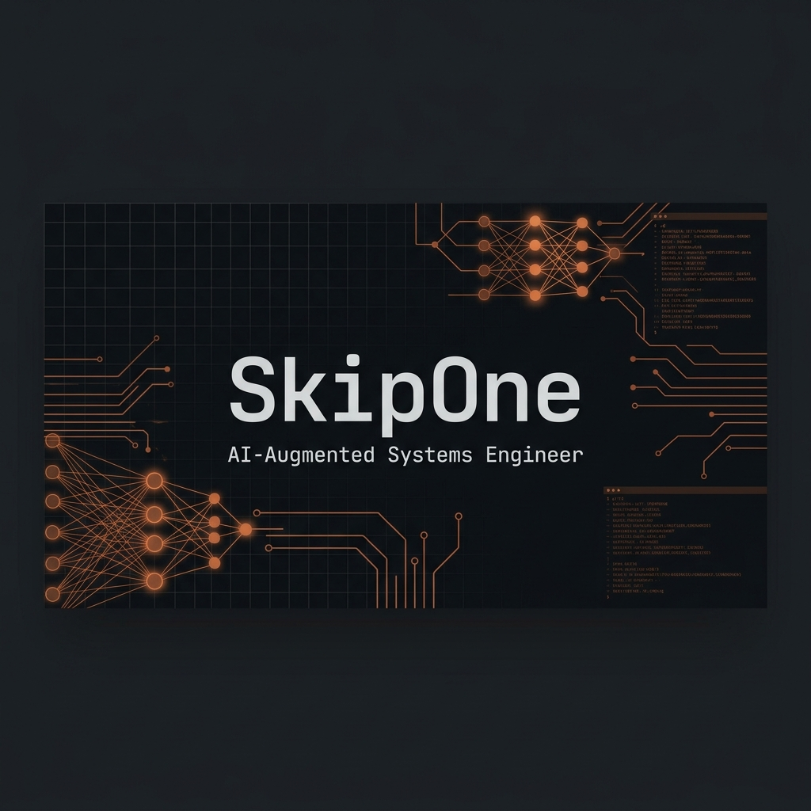

<div align="center">
  
</div>

<div align="center">
  <br />
  <a href="https://git.io/typing-svg"></a>
  <br />
  <i>«Иногда история и тепло одного осколка огня бывает удивительнее и жарче, чем пламя целого кострища»</i>
  <br /><br />
</div>

---

### ⚡ System Status

```yml
● skipone.service - AI-Augmented Systems Engineer
     Loaded: active (running) since 2024
     Status: "Building full-stack products from concept to automated production deployment."
     Location: Krasnoyarsk, Russia
     Philosophy: "Build systems, not just code."
     Core Focus: Python · TypeScript · Go · Neural integrations (RAG, Local LLMs, Agentic workflows)
```

---

### 🛠 Tech Stack & Ecosystem

| Layer | Tools & Technologies |
| :--- | :--- |
| **Languages** | `Python` · `TypeScript` · `Go` · `SQL` · `Bash` |
| **Backend & DB** | `NestJS` · `Prisma` · `PostgreSQL` · `Redis` · `Socket.IO` · `Caddy` |
| **Frontend** | `Next.js` · `React` · `TailwindCSS` · `Three.js` (3D layouts) |
| **AI & Infra** | `Docker` · `Linux` · `LM Studio` · `Faster Whisper` · `RAG` · `Anthropic` |

<br />

<div align="center">
  
</div>

---

### 📊 Statistics & Activity

<div align="center">
  
  
</div>

<br />

<div align="center">
  
</div>

---

### 📂 Featured Projects

#### 🚀 [SHKKRIT](https://github.com/Awoowe123/SHKKRIT) — College Timetable Platform
*A comprehensive student utility including 3D Interactive Campus Maps, full offline PWA capabilities, and responsive system engines.*
* **Tech Stack**: `Next.js` · `Prisma` · `PostgreSQL` · `Three.js`

#### 🤖 [SkipOneAI](https://github.com/Awoowe123/SkipOneAI) — Autonomous AI Telegram Twin
*An active Telegram replica powered by Agentic LLMs with style cloning, local high-speed transcription (Whisper), and deep RAG knowledge.*
* **Tech Stack**: `Python` · `Telethon` · `RAG` · `Whisper`

#### 🎮 [EduPlay](https://github.com/Awoowe123/EduPlay) — Real-Time Educational Games
*Multiplayer classroom games featuring instant state syncing, socket connections, and generative automated challenges.*
* **Tech Stack**: `Next.js` · `NestJS` · `Socket.IO` · `Redis`

---

### 🌐 System Access & Connections

<div align="center">
  <a href="https://t.me/l_SkipOne_l" target="_blank">
    
  </a>
  &nbsp;&nbsp;
  <a href="mailto:contact@skipone.dev" target="_blank">
    
  </a>
  &nbsp;&nbsp;
  <a href="https://github.com/Awoowe123" target="_blank">
    
  </a>
</div>

---

<div align="center">
  <h3>🐍 System Activity</h3>
  <br />
  <picture>
    <source media="(prefers-color-scheme: dark)" srcset="https://raw.githubusercontent.com/Awoowe123/Awoowe123/output/github-snake-dark.svg" />
    <source media="(prefers-color-scheme: light)" srcset="https://raw.githubusercontent.com/Awoowe123/Awoowe123/output/github-snake.svg" />
    
  </picture>
  <br /><br />
  <sub><i>build systems, not just code • SkipOne 2026</i></sub>
</div>
