<div align="center">
  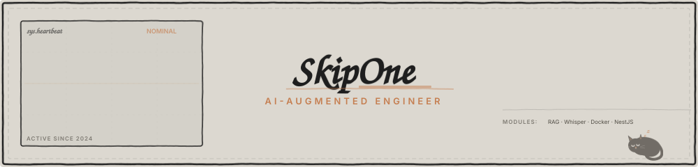
</div>

<div align="center">
  <br />
  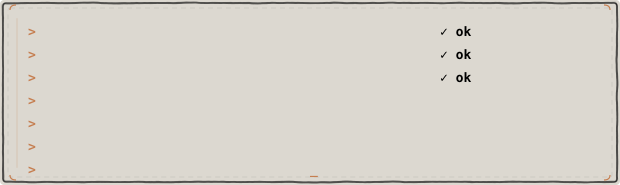
  <br /><br />
  <i>«Иногда история и тепло одного осколка огня бывает удивительнее и жарче, чем пламя целого кострища»</i>
  <br /><br />
</div>

---

<div align="center">
  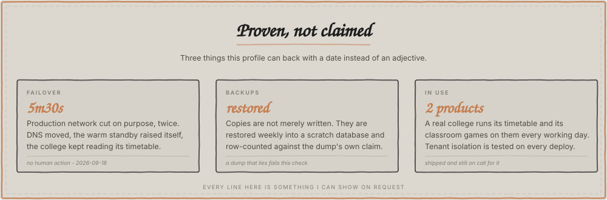
</div>

---

<h3>✦ System Status</h3>

```yml
● skipone.service - AI-Augmented Systems Engineer
     Loaded: active (running) since 2024
     Status: "Building full-stack products from concept to automated production deployment."
   Location: Krasnoyarsk, Russia
 Philosophy: "Build systems, not just code."
 Core Focus: Python · TypeScript · Go · Neural integrations (RAG, Local LLMs, Agentic workflows)
```

---

<h3>✦ Featured Projects</h3>

<table>
  <tr>
    <td width="50%">
      <a href="https://eduklass.ru">
        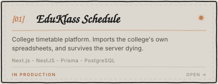
      </a>
    </td>
    <td width="50%">
      <a href="https://kvestnik.ru">
        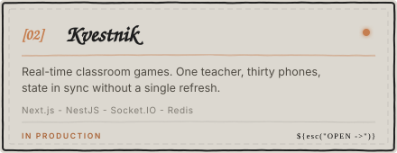
      </a>
    </td>
  </tr>
  <tr>
    <td width="50%">
      <a href="https://github.com/Awoowe123/SkipOneAI">
        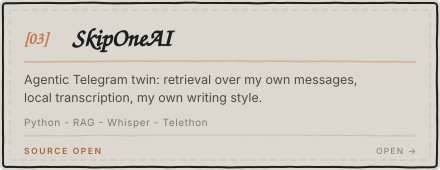
      </a>
    </td>
    <td width="50%">
      <a href="https://kvcg.ru">
        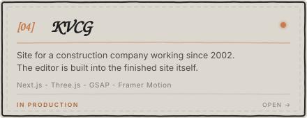
      </a>
    </td>
  </tr>
</table>

<div align="center">
  <a href="https://skipone.dev">
    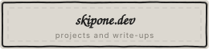
  </a>
  <br />
  <sub>the full list, the write-ups and how the failover actually behaves</sub>
</div>

<h4>✦ Handed over to me, in development</h4>

<table>
  <tr>
    <td width="50%">
      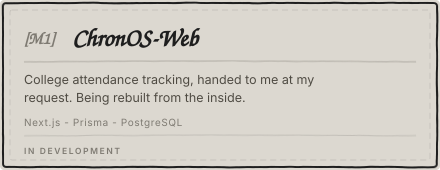
    </td>
    <td width="50%">
      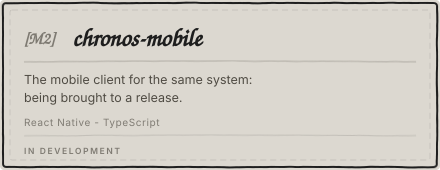
    </td>
  </tr>
</table>

<div align="center">
  <sub>Closed circuit, shown on request.</sub>
</div>

---

<h3>✦ Tech Stack &amp; Ecosystem</h3>

```yaml
# system_config.yaml
skipone:
  kernel: "SkipOne OS v2.6"
  languages: [ "Python", "TypeScript", "Go", "SQL", "Bash" ]
  backend:
    frameworks: [ "NestJS", "FastAPI" ]
    database:   [ "PostgreSQL", "Redis" ]
    orm:        [ "Prisma" ]
  frontend:     [ "Next.js", "React", "Three.js", "TailwindCSS" ]
  infra_ai:     [ "Docker", "Linux", "Caddy", "RAG", "Faster Whisper", "LM Studio" ]
  operations:   [ "hourly offsite copies", "warm standby", "automatic DNS failover" ]
```

<div align="center">
  
</div>

---

<h3>✦ Statistics &amp; Activity</h3>

<div align="center">
  
</div>

<br />

<div align="center">
  <picture>
    <source media="(prefers-color-scheme: dark)" srcset="https://raw.githubusercontent.com/Awoowe123/Awoowe123/output/github-snake-dark.svg" />
    <source media="(prefers-color-scheme: light)" srcset="https://raw.githubusercontent.com/Awoowe123/Awoowe123/output/github-snake.svg" />
    
  </picture>
</div>

---

<h3>✦ System Access &amp; Connections</h3>

<div align="center">
  <a href="https://t.me/l_SkipOne_l">
    
  </a>
  &nbsp;
  <a href="mailto:contact@skipone.dev">
    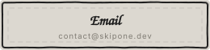
  </a>
  &nbsp;
  <a href="https://skipone.dev">
    
  </a>
</div>

<div align="center">
  <br />
  <sub><i>✦ SkipOne 2026 ✦</i></sub>
</div>
